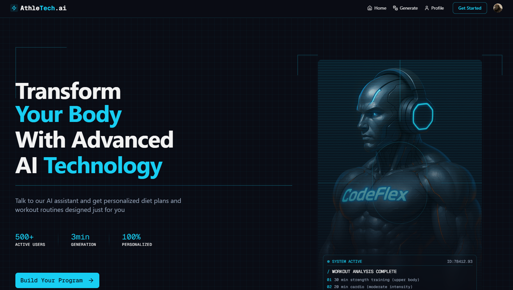

# 🧠 AthleTech.ai

AthleTech is an AI-powered fitness companion that generates personalized **workout** and **diet plans** based on minimal user input. Just answer a few questions, and let AthleTech do the rest.

> Built to make fitness simple, intelligent, and accessible to everyone.

---

## 🚀 Features

- 🔍 Personalized workout & diet plans using AI  
- 👤 Authentication with [Clerk](https://clerk.dev/)  
- 💬 AI response generation via [Gemini](https://deepmind.google/technologies/gemini/)  
- 🧠 Smart API interactions with [Vapi](https://vapi.ai/)  
- 🎨 Beautiful UI with [shadcn/ui](https://ui.shadcn.com/)  
- ⚡ Real-time database with [Convex](https://www.convex.dev/)  
- 💻 Built on [Next.js 14](https://nextjs.org/) with App Router  

---

## 🛠️ Tech Stack

| Tech         | Purpose                               |
|--------------|----------------------------------------|
| **Next.js**  | React framework for building the app   |
| **Clerk**    | Authentication and user management     |
| **Vapi**     | Voice-based interactions               |
| **Gemini AI**| Workout & diet generation logic        |
| **Shadcn/UI**| Reusable components and design system  |
| **Convex**   | Backend-as-a-service, realtime storage |

---

## 📸 Preview



---

## 📦 Getting Started

Follow these steps to set up the project locally:

### 1. Clone the repository

```bash
git clone https://github.com/your-username/athletech.git
cd athletech
```

### 2. Install dependencies

Using npm:

```bash
npm install
```

Or using yarn:

```bash
yarn
```

### 3. Set up environment variables

Create a `.env.local` file at the root of your project and add the following:

```env
CLERK_PUBLISHABLE_KEY=your_clerk_publishable_key
CLERK_SECRET_KEY=your_clerk_secret_key
VAPI_API_KEY=your_vapi_api_key
GEMINI_API_KEY=your_gemini_api_key
CONVEX_URL=your_convex_deployment_url
```

You can find these keys in your respective provider dashboards:
- Clerk: https://dashboard.clerk.dev/
- Vapi: https://vapi.ai/
- Gemini: https://ai.google.dev/gemini-api
- Convex: https://dashboard.convex.dev/

---

### 4. Run the development server

```bash
npm run dev
```

Or with yarn:

```bash
yarn dev
```

The app should now be running at [http://localhost:3000](http://localhost:3000).

---

## 🤖 AI Magic

AthleTech uses **Gemini AI** to generate tailored fitness plans and leverages **Vapi** for natural voice interaction.

Think of it as your **virtual trainer & nutritionist** — always ready to help 💪

---

## 📬 Contact

- 💼 [LinkedIn](https://www.linkedin.com/in/riteshpandey04/)
- 🐙 [GitHub](https://github.com/coderpy04)
- 📸 [Instagram](https://www.instagram.com/riteshpy_/)

---
